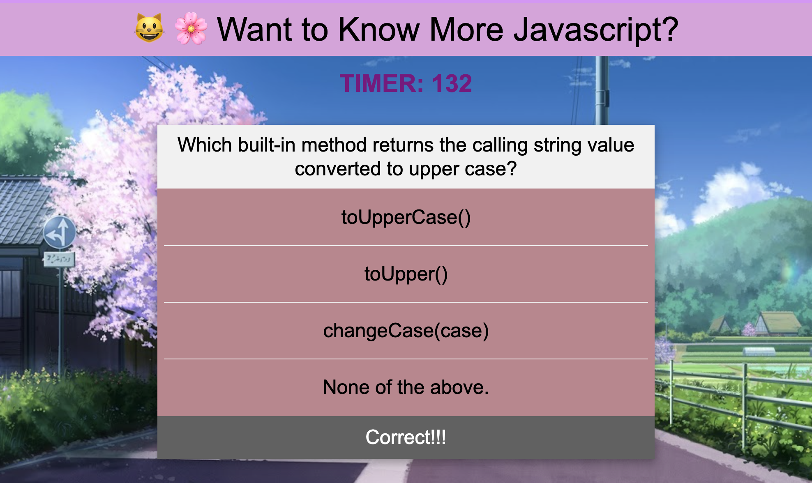

# code-quiz-byKat

### Review
* The URL of the functional deployed application:

https://kattheswagger1122.github.io/code-quiz-byKat/

# 04 Web APIs: Code Quiz

As you proceed in your career as a web developer, you will probably be asked to complete a coding assessment, which is typically a combination of multiple-choice questions and interactive challenges. For this challenge, you will build a timed code quiz that's made up of multiple-choice questions. This app will run in the browser and feature dynamically updated HTML and CSS powered by your JavaScript code. It will also feature a clean and polished user interface and be responsive, ensuring that it adapts to multiple screen sizes.

## User Story

```
AS A coding boot camp student
I WANT to take a timed quiz on JavaScript fundamentals that stores high scores
SO THAT I can gauge my progress compared to my peers
```
## What I've used outside of week 4
```
1. Bootstrap from week 5
2. link other style sheet to the overall design of the page
```
## Acceptance Criteria

```
GIVEN I am taking a coding quiz
WHEN I click the Start button
Then a timer starts and I am presented with a question
WHEN I answer a question
Then I am presented with another question
WHEN I answer a question incorrectly
THEN time is subtracted from the clock
WHEN all questions are answered or the timer reaches 0
THEN the game is over
WHEN the game is over
THEN I can save my initials and score
```
## ScreenShots
```
1 Main Page


2 Quiz Page


3 Wrong Answer Display


4 Right Answer Display


5 Result Page


6 Score Board


7 Clear


---
© 2022 Trilogy Education Services, LLC, a 2U, Inc. brand. Confidential and Proprietary. All Rights Reserved.
